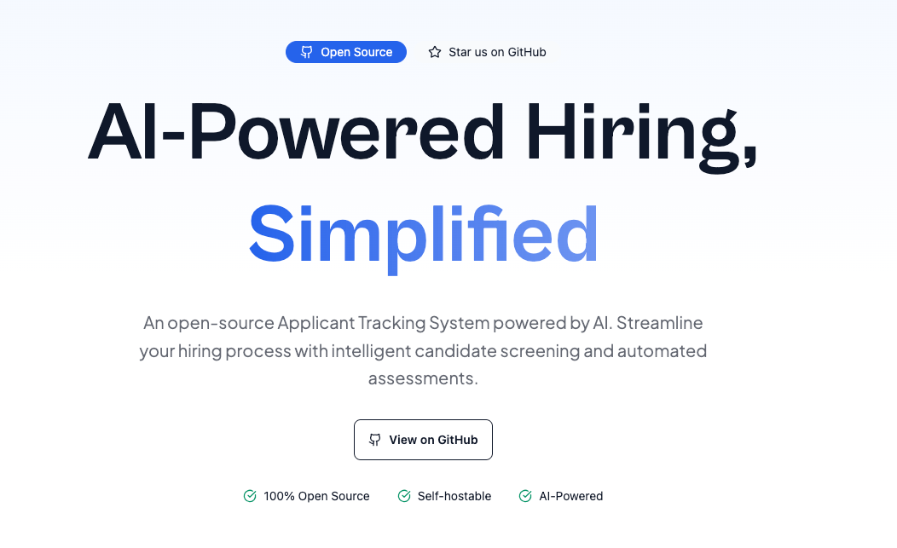

<h1 align="center" style="font-size: 40px;">
  	 TrackWiseAI
</h1>

   
   

  <b>Streamline Your Hiring Process</b> 

   <b>TrackWiseAI</b> is an open-source Applicant Tracking System that helps organizations manage their hiring processes efficiently, leveraging AI to enhance candidate evaluation and communication.
  <a href="https://trackwiseai.com/">Visit Site</a>

  
  <b>Landing Page</b> 
  💥 Landing page showcasing features and benefits 💥

  <a href="#introduction"><strong>Introduction</strong></a> ·
  <a href="#tech-stack"><strong>Tech Stack</strong></a> ·
  <a href="#implementation"><strong>Implementation</strong></a> ·
  <a href="#routes"><strong>App Routes</strong></a> ·
  <a href="#how-to-run-project"><strong>How to Run Project</strong></a> ·
  <a href="#contributions"><strong>Contributions</strong></a> ·
  <a href="#license"><strong>License</strong></a>

 

## Introduction

TrackWiseAI is an innovative Applicant Tracking System designed to streamline hiring processes for organizations. It provides comprehensive tools for tracking candidates, managing job postings, and delivering AI-powered updates to hiring teams.

## Tech Stack

- [Next.js](https://nextjs.org/) – framework
- [DaisyUI](https://daisyui.com/) – UI components
- [Tailwind](https://tailwindcss.com/) – CSS
- [Upstash](https://upstash.com/) – Queue Management
- [Vercel](https://vercel.com/) – hosting
- [OpenAI](https://openai.com/) – AI updates generation

## Implementation

- Built using Next.js App Router for optimal performance and SEO.
- Supabase handles authentication and secure data storage.
- OpenAI integration for generating personalized candidate updates.
- Real-time notifications system for instant updates.
- Responsive design for both desktop and mobile interfaces.

## Routes

| Path | Production | Local |
| ---- | ---------- | ----- |
| Landing page | / | localhost:3001/ |
| Signup | / | localhost:3000/signup |
| Dashboard | /dashboard | localhost:3000/dashboard |
| Job Postings | /jobs | localhost:3000/jobs |
| Candidate Profile | /candidates/[id] | localhost:3000/candidates/[id] |
| Settings | /settings | localhost:3000/settings |

## How to Run Project

1. Clone the repository with `git clone https://github.com/manishsaraan/trackwise-ai.git`
2. Install dependencies with `yarn install`
3. Set up environment variables (check `.env.example`)
4. Run the project with `yarn dev`

Visit: [http://localhost:3000](http://localhost:3000) to view the app.

Visit: [http://localhost:3001](http://localhost:3000) to view the landing page.

## Contributions

Here's how you can contribute:

- [Open an issue](https://github.com/manishsaraan/trackwise-ai/issues) if you believe you've encountered a bug.
- Make a [pull request](https://github.com/manishsaraan/trackwise-ai/pulls) to add new features, make quality-of-life improvements, or fix bugs.

## License

TrackWiseAI is licensed under the MIT License. You can [find it here](https://github.com/manishsaraan/trackwise-ai/blob/main/LICENSE).